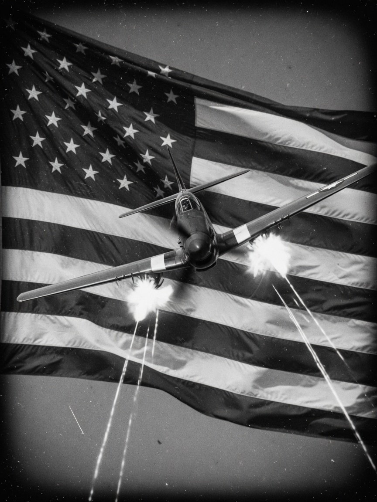
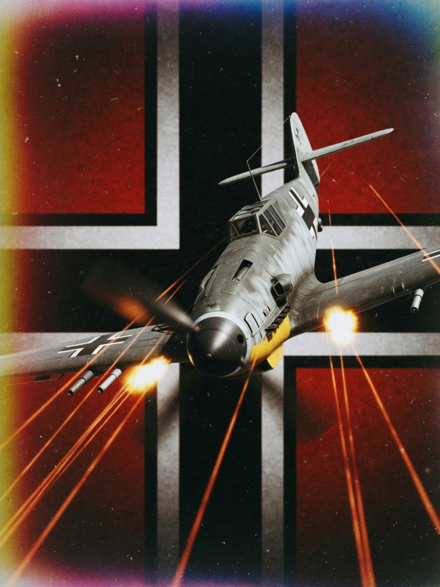
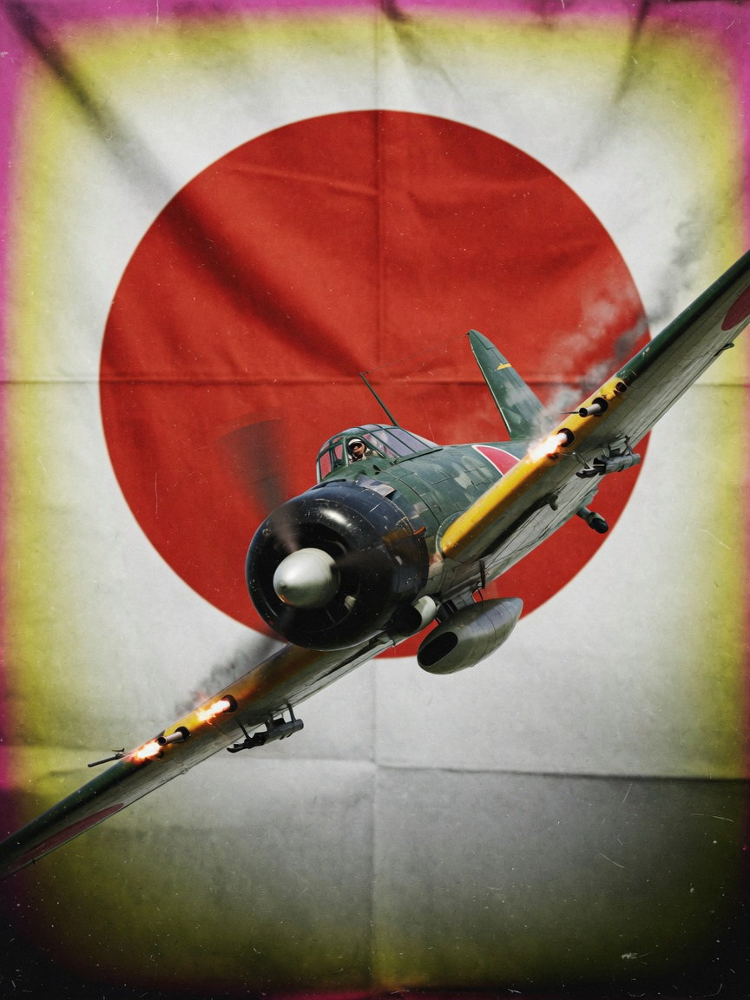

# Contrails Air: Combat

[中文](README.md) | **English**

*Contrails Air: Combat* is a browser WWII air-combat game with stylised **low-poly art**. Lead your flight on escort, interception, bombing and torpedo missions — use speed and altitude wisely to make it home from the furball.

## Play online

https://wwwang176.github.io/Contrails-Air-Combat/

## Features

- **Three campaigns, ten missions**: from European bomber routes, night raids and snowfield dive-bombing in the East to Pacific fleet defence and low-level torpedo runs.
- **Ten WWII aircraft**: each with its own speed, climb, turn, firepower and payload.
- **Energy-based dogfighting**: dive to gain speed; hard turns and climbs bleed energy.
- **Varied objectives**: escort, interception, air superiority, level bombing, airfield strafing, convoy interdiction and torpedo attacks.
- **Formation AI**: wingmen hold formation, cover their leader and pick their own targets.
- **Skirmish mode**: mix any aircraft on either side, up to 20 each, and choose terrain, altitude, time of day and the player's flight lead.
- **Living battlefield**: tracers, explosions, smoke, searchlights, splashes, wakes and wreckage keep the fight changing.
- **Immersive audio**: engines, guns and explosions carry direction and distance; far-off sounds are duller and arrive later.

## Three campaigns

<table>
  <tr>
    <td width="33%" align="center"></td>
    <td width="33%" align="center"></td>
    <td width="33%" align="center"></td>
  </tr>
  <tr>
    <td valign="top"><strong>USA</strong><br>Escort and strike over Europe, fleet defence off Okinawa.<br><br><small>Over Berlin · The Leuna Refinery · Off Okinawa</small></td>
    <td valign="top"><strong>Germany</strong><br>Intercept the bomber streams, dive-bomb on the snowfield, raid by night and strafe airfields at low level.<br><br><small>Over Merseburg · Rzhev · Night over Poltava · Operation Bodenplatte</small></td>
    <td valign="top"><strong>Japan</strong><br>Escort over Guadalcanal, cut the supply lines at Leyte and torpedo the fleet off Rennell Island.<br><br><small>Over Guadalcanal · The Leyte Front · Rennell Island</small></td>
  </tr>
</table>

## Aircraft

| Side | Fighters | Bombers |
| --- | --- | --- |
| USA | P-51D Mustang, F6F-5 Hellcat, F4F-4 Wildcat | B-17G Flying Fortress |
| Germany | Bf 109 K-4 | He 111 H-6, Ju 87 B-2 Stuka |
| Japan | Ki-84 Frank, A6M5 Zeke | G4M Betty |

The hangar shows each aircraft's looks, performance and history; skirmish lets you mix aircraft from both sides freely.

## Controls

| Input | Action |
| --- | --- |
| Mouse move | Move the aim point; the aircraft flies toward it |
| Left mouse button | Lock the mouse / fire; drop bombs or torpedoes in the bombsight view |
| Hold right mouse button and drag | Look around freely; recentres on release |
| `W` / `S` | Throttle up / throttle down and slow |
| `V` | Toggle first-person and third-person view |
| `B` | Toggle the bombing / torpedo view (where available); fighters carrying bombs drop them directly |
| `Tab` | Hold to show the battle status and scoreboard |
| `I` / `O` / `G` | AI takeover / formation order markers / free spectator camera |
| `Esc` | Release the mouse and open the pause menu |

In the free spectator camera, move with `W` `A` `S` `D`, rise and descend with `Q` `E`, and hold `Shift` to go faster.

## Play locally

```bash
npm install
npm run dev
```

Requires [Node.js](https://nodejs.org/); open `http://localhost:5173` once it starts. A desktop browser and mouse are recommended.

---

Built with TypeScript, Three.js and Vite.
