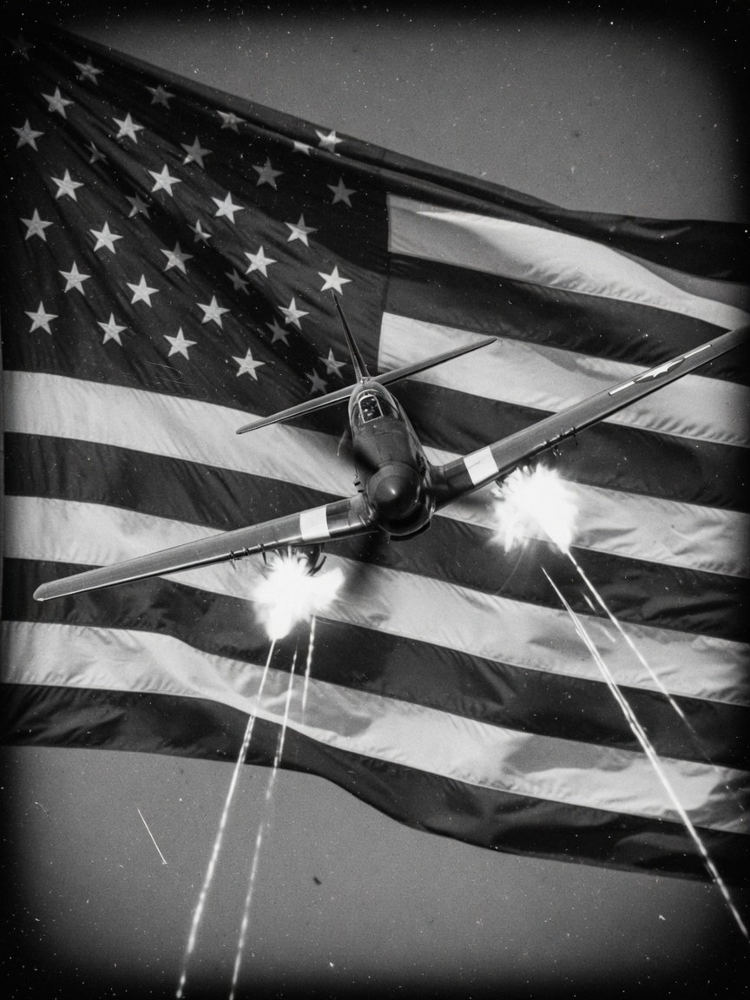
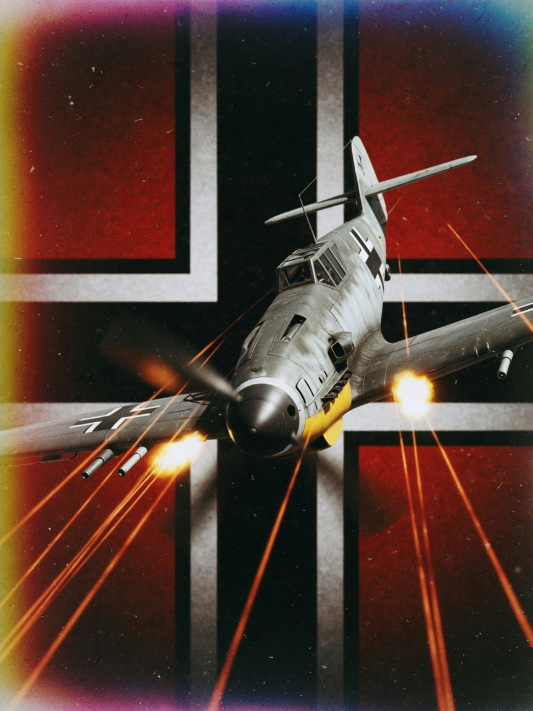
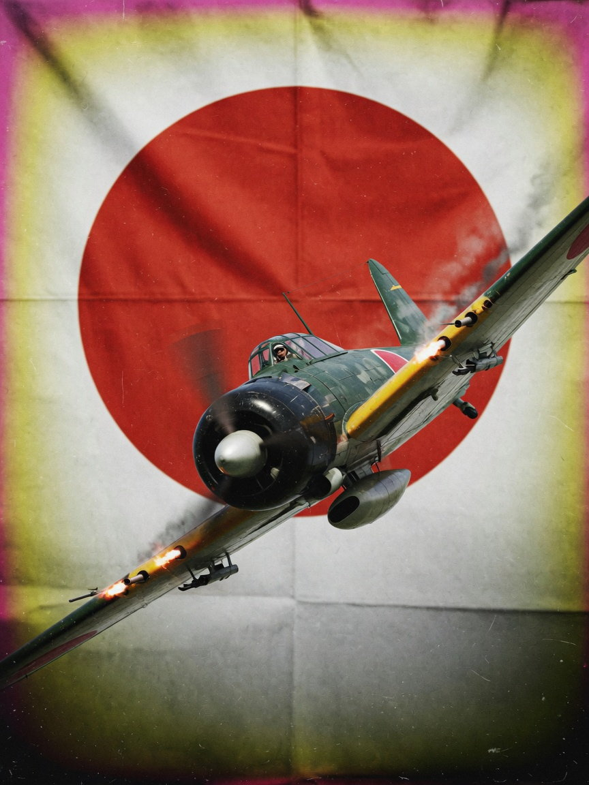

# Contrails Air: Combat

《Contrails Air: Combat》是一款採用風格化 **low-poly 美術**的瀏覽器二戰空戰遊戲。率領編隊執行護航、攔截、轟炸與魚雷攻擊；善用速度與高度，才能在混戰中活著返航。

## 遊戲特色

- **三條戰役、九場任務**：從歐洲轟炸航線、東線夜襲，到太平洋艦隊防空與低空雷擊。
- **九種二戰軍機**：各有不同的速度、爬升、迴轉、火力與掛載特性。
- **講究能量的空戰**：俯衝換取速度，急轉與爬升則會消耗能量。
- **多樣任務目標**：護航、攔截、空中殲滅、水平轟炸、機場掃射與魚雷攻擊。
- **編隊 AI**：友軍會維持隊形、掩護長機並選擇目標。
- **自由遭遇戰**：任意混編雙方機種，最多各 20 架，並選擇地形、高度、時間與玩家領隊。
- **動態戰場**：曳光彈、爆炸、煙霧、探照燈、水花、尾流與殘骸構成持續變化的戰場。

## 三條戰役

<table>
  <tr>
    <td width="33%" align="center"></td>
    <td width="33%" align="center"></td>
    <td width="33%" align="center"></td>
  </tr>
  <tr>
    <td valign="top"><strong>美軍</strong><br>歐洲護航與轟炸、沖繩艦隊防空。<br><br><small>柏林上空 · 梅澤堡的油廠 · 沖繩外海</small></td>
    <td valign="top"><strong>德軍</strong><br>攔截轟炸機流、夜襲與低空機場突擊。<br><br><small>梅澤堡上空 · 波爾塔瓦之夜 · 底板行動</small></td>
    <td valign="top"><strong>日軍</strong><br>瓜達康納爾護航、漢口迎擊與倫內爾島雷擊。<br><br><small>瓜達康納爾上空 · 漢口上空 · 倫內爾島</small></td>
  </tr>
</table>

## 可投入作戰的軍機

| 陣營 | 戰鬥機 | 轟炸機 |
| --- | --- | --- |
| 美軍 | P-51D Mustang、F6F-5 Hellcat、F4F-4 Wildcat | B-17G Flying Fortress |
| 德軍 | Bf 109 K-4 | He 111 H-6 |
| 日軍 | Ki-84 疾風、A6M5 零戰 | G4M 一式陸攻 |

機庫提供各機種的外觀、性能與背景資料；遭遇戰則能自由混編雙方軍機。

## 操作方式

| 操作 | 功能 |
| --- | --- |
| 滑鼠移動 | 移動瞄準點，飛機會朝向瞄準點飛行 |
| 滑鼠左鍵 | 鎖定滑鼠／開火；在轟炸視角中投彈或投雷 |
| 按住滑鼠右鍵拖曳 | 自由觀察四周，放開後回正 |
| `W` / `S` | 增加油門／降低油門與減速 |
| `V` | 切換第一人稱與第三人稱視角 |
| `B` | 切換轟炸／投雷視角（限可用機種） |
| `Tab` | 按住查看戰況與計分板 |
| `I` / `O` / `G` | AI 接管／編隊命令標記／自由觀戰鏡頭 |
| `Esc` | 釋放滑鼠並開啟暫停選單 |

自由觀戰鏡頭使用 `W` `A` `S` `D` 移動、`Q` `E` 升降，按住 `Shift` 可加速。

## 本機遊玩

```bash
npm install
npm run dev
```

需要 [Node.js](https://nodejs.org/)；啟動後開啟 `http://localhost:5173`。建議使用桌面瀏覽器與滑鼠。

---

Built with TypeScript, Three.js and Vite.
